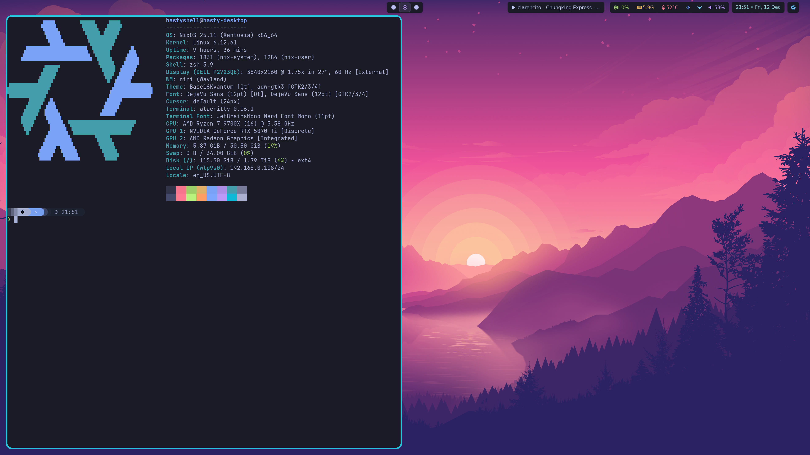
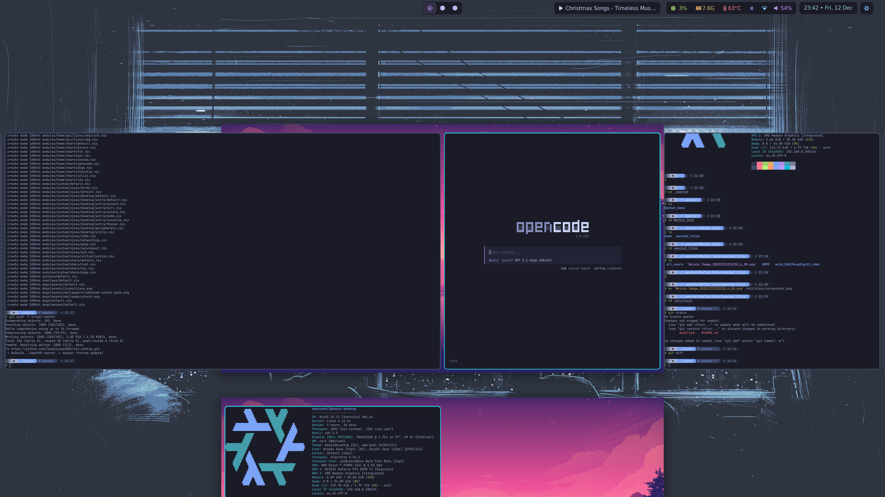

# ❄️ nix-config

Personal Nix flake for my Linux desktops (with room for macOS later). It keeps system and home configuration in one place, driven by small feature flags and a Wayland-first desktop stack.

## Why Nix and NixOS

- Manage system, desktop, and development environments as code rather than ad‑hoc tweaks.
- Avoid “configuration black holes” by making everything reproducible and rebuildable from scratch.
- Gain a clean, predictable package management story and project‑local environments that are easy to recreate.

## Configuration philosophy

- Express all system and user configuration declaratively through Nix; avoid imperative one‑off commands.
- Prefer concentrating configuration and packages at the user level via Home Manager, so most of your setup can be reproduced even on non‑NixOS systems.
- Keep the base system small and uncluttered, without preinstalled language runtimes or heavy dev stacks.
- Use per‑project Nix dev shells, auto‑activated via `direnv`, as the primary way to provide development tooling.
- If a project has no dev shell, define one in a parent directory; fall back to containers for projects that are painful to model in Nix.
- Aim for configurations that are minimal, clean, and fully reproducible across machines.

## Desktop preferences

- Prefer a window manager over a full desktop environment to keep things simple and loosely coupled.
- Use a keyboard‑driven workflow with keybindings for most common actions.
- Make the terminal and an application launcher the core of the desktop experience.
- Avoid unnecessary applications; favor lightweight TUI tools over heavy GUI apps and use web apps where they make sense.
- Keep the bar minimal and focused, showing only information that matters in daily use; redundant items belong in the launcher, not on the bar.
- Concentrate bar elements toward the top‑right to stay out of the way and reduce visual noise.
- Treat aesthetics as “calm and coherent enough,” preferring simple, harmonious visuals over flashy themes.

## Screenshots



## Repo layout
- `flake.nix`: Entrypoint using `flake-parts`, overlays, and a custom package set `mypkgs`.
- `hosts/`: Per-machine definitions combining system modules + home-manager modules and user metadata.
- `modules/`: Reusable building blocks
  - `system/`: NixOS modules (desktop, peripherals, stylix, secure boot, graphics, etc.)
  - `home/`: Home Manager modules (shell, editor, terminal, Wayland apps, theming)
- `options/`: Custom feature flags (niri, walker, waybar, sunshine, nvidia, lanzaboote, etc.).
- `overlays/`: Overlays for pkgs.
- `pkgs/`: Custom packages and assets.

## Host profiles
- `hasty-desktop`: Daily driver with NVIDIA, secure boot via lanzaboote, greetd + niri session, waybar, walker, Thunar, Sunshine for remote desktop.
- `vmware-desktop`: VM-oriented variant sharing the same Wayland stack (niri + walker + waybar + greetd + Thunar + Sunshine) without the NVIDIA/secure-boot bits.

## Desktop & user stack
- **WM/session**: Niri from `niri-flake`, Wayland-first environment variables baked in.
- **Greeter/session start**: greetd (SDDM optional toggle).
- **Bar & launcher**: Waybar with custom styling, Walker launcher.
- **Lock & idle**: swaylock; swayidle available via flag.
- **Input/IME**: fcitx5.
- **Notifications/OSD**: mako + avizo volume/brightness OSD.
- **Display rules**: kanshi for multi-monitor profiles.
- **File manager**: Thunar.
- **Remote desktop**: Sunshine toggle.
- **Theming**: Stylix plus curated wallpapers/icons in `pkgs/assets`.
- **CLI base**: zsh + starship, zellij, direnv, git defaults, fzf, custom package set in `modules/home/share`.

## Neovim
Neovim is enabled via Home Manager and sources my external config (`inputs.nvim-config`, repo: [TangSiyang2001/diy.nvim](https://github.com/TangSiyang2001/diy.nvim)) directly into `~/.config/nvim`. Extra build/runtime deps are pre-wrapped (nixd, lua-language-server, stylua, nixfmt, statix, deadnix, rg, fzf, shellcheck/shfmt, sql/toml/yaml/markdown/Actions tooling) so LSPs, formatters, and Telescope work out of the box.

## Custom options
See `options/default.nix` for feature switches like `custom.linux.desktop.wm.niri.enable`, `custom.linux.desktop.bar.waybar.enable`, `custom.nixos.graphics.nvidia.enable`, `custom.nixos.secureBoot.lanzaboote.enable`, `custom.nixos.desktop.remoteDesktop.sunshine.enable`, etc. Hosts compose these to turn features on/off per machine.

## Using `nh`
Prereqs: flakes enabled, `nh` installed (e.g., `nix profile install nixpkgs#nh`). Run from the repo root:

```bash
# Switch a host
nh os switch . #hostname

# Dry-run/test
nh os test . #hostname
```

For new machines, clone the repo, pick/create a host under `hosts/nixos/`, adjust feature flags in `globalOptions`, then run `nh os switch` with the matching `.#hostname`.

## Acknowledgements
- [ryan4yin/nix-config](https://github.com/ryan4yin/nix-config): many configurations were adapted from here.
- [niksingh710/ndots](https://github.com/niksingh710/ndots): the flake layout inspired how this repo is organized.
- [vimjoyer](https://github.com/vimjoyer): his YouTube videos taught me many core Nix concepts.
- [nix-community/lanzaboote](https://github.com/nix-community/lanzaboote): solved secure boot alongside Windows in my dual-boot setup.
- [hercules-ci/flake-parts](https://github.com/hercules-ci/flake-parts): helped structure my flake more like real software engineering.
- [sodiboo/niri-flake](https://github.com/sodiboo/niri-flake): made the Niri configuration straightforward and reproducible.
- [basecamp/omarchy](https://github.com/basecamp/omarchy): drew from its Linux desktop aesthetic and borrowed two favorite wallpapers.
